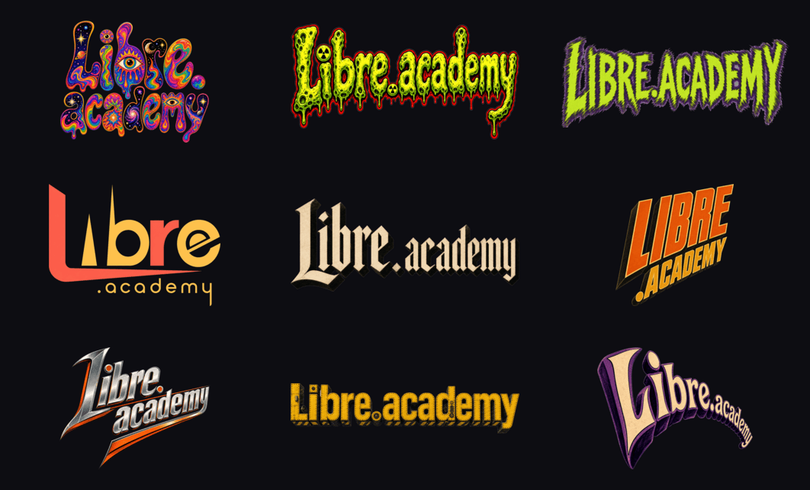
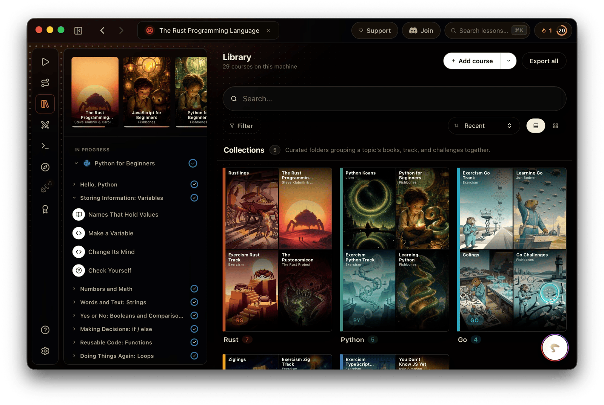
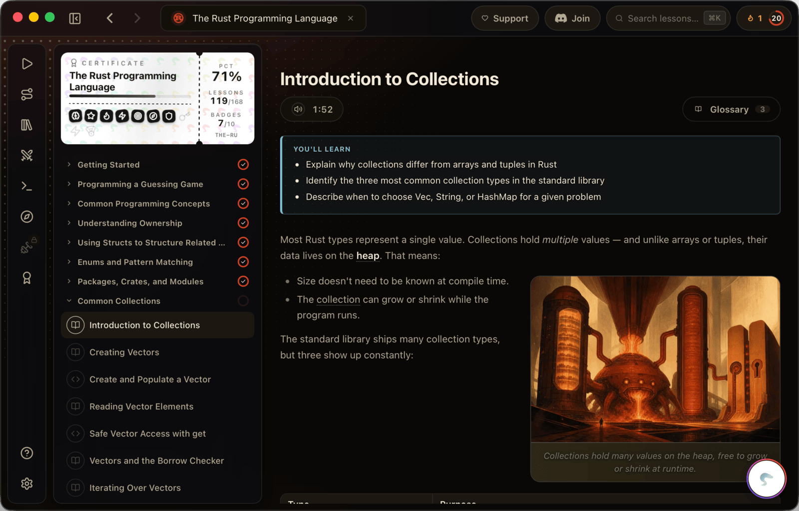

<div align="center">


# libre.academy

**The marketing + onboarding site for [Libre](https://github.com/InfamousVague/Fishbones)** — the
interactive coding-course platform that turns any technical book into a course.
A download-first landing site with a vintage 1960s sci-fi-paperback soul.

<p align="center">
  <a href="https://libre.academy"></a>
  
  
  
  
</p>

</div>

---

## 🪐 The vibe

The site is built like a pulp paperback rack. The homepage is a scroll through
themed **parallax scenes** — a cosmic hero, a robot showcase, a looming kaiju, an
alien invasion, a violet time-warp — each with its own accent colour and a
scroll-driven foreground asset. Everything leans on the amber brand triad
(`#f2a93b → #e0734d → #a85e1c`) and the `--libre-*` design tokens.

> All artwork lives in [`public/`](public/) — logos in
> [`public/logos/`](public/logos), app shots in
> [`public/screenshots/`](public/screenshots), and the parallax backdrops +
> moving assets in [`public/backgrounds/`](public/backgrounds).

## 🎭 The rotating brand logo

On **every page load** the hero picks one of **nine** themed brand marks at
random (`src/lib/rotationLogo.ts` → `pickRotationLogo()`), so the wordmark
cycles through the whole genre wardrobe. The nav keeps a fixed
[`nav-logo.png`](public/logos/nav-logo.png) wordmark — a wide logotype reads
better at bar height.



<div align="center">

`groovy` · `slime` · `alien` · `atomic` · `noir` · `pulp` · `rocket` · `robot` · `time-warp`

</div>

## 📸 The app it sells

The homepage carousel ([`ScreenshotCarousel`](src/components/ScreenshotCarousel.tsx))
shows the Libre desktop app — a real editor, hidden-test grading, native
runtimes, and a local AI tutor.

<table>
  <tr>
    <td width="33%" valign="top">
      <br>
      <sub>📚 <b>Library</b> — every course, grouped into collections</sub>
    </td>
    <td width="33%" valign="top">
      <br>
      <sub>🧭 <b>Paths</b> — goal-oriented routes through the catalogue</sub>
    </td>
    <td width="33%" valign="top">
      <br>
      <sub>📝 <b>Lessons</b> — prose, a Monaco editor &amp; hidden tests</sub>
    </td>
  </tr>
</table>

<sub>More shots in <a href="public/screenshots">public/screenshots/</a>: editor, challenges, themes.</sub>

## 🗂 What's in here

```
src/
  components/   Nav · Footer · LogoHero · ParallaxBg · ScrollAsset
                ScreenshotCarousel · TipPopover · CodecademyComparison
                spotlights/BookCarousel · icons/
  data/         courses-manifest.json · courses · languages · docs
  lib/          rotationLogo · markdown (shiki) · siteStats · useSeo
  pages/        Home · Courses · CourseDetail · Languages · LanguageDetail
                Download · Docs · Blog · About · SecurityAudit · Support · …
  styles/       global.css · tokens.css

public/
  logos/        🎭 9 themed hero variants + the nav wordmark
  screenshots/  📸 desktop-app captures (library, paths, lessons, …)
  backgrounds/  🪐 parallax backdrops (bg-*.jpg) + moving assets (asset-*.png)
  learn/        ⚠ the embedded web app — synced from kata, gitignored

scripts/        sync-learn.mjs · sync-starter-courses.mjs · prerender.mjs
deploy/         Caddyfile (production site block)
.github/        workflows/deploy.yml · assets/ (these README graphics)
```

## 🧰 Tech stack

| | |
|---|---|
| ⚡ **Vite 8 + React 19 + TypeScript** | same shape as `mattssoftware` |
| 🧭 **react-router-dom v7** | client-side routing |
| 🎨 **lucide-react** | iconography (inline SVG for the GitHub mark) |
| 🎞 **framer-motion** | scroll-linked parallax + the logo/screenshot motion |
| 📝 **markdown-it + shiki** | docs/blog rendering, `github-dark` code fences |
| 🎚 **@mattmattmattmatt/base** | design-token CSS, linked `file:../../Libs/base` |

> Don't copy primitives — link the `base` lib the way `mattssoftware` does.

## 🚀 Local dev

```bash
npm install            # 1. deps

# 2. (optional) sync the embedded /learn app + starter courses from your
#    local kata checkout. Builds still work without it — /learn shows a
#    stub and course previews say "preview unavailable".
npm run sync:learn
npm run sync:courses

npm run dev            # 3. dev server
npm run build          # 4. tsc + vite build (+ prerender) — verify it's clean
npm run preview
```

The site auto-detects the kata checkout at `../../Apps/kata` (the typical
`/Development/{Apps,Web}` layout). Override via `FISHBONES_SRC=/path/to/kata`.

## 🌐 The web app (`/learn/*`)

The browser build of Libre lives at **[libre.academy/learn](https://libre.academy/learn)** —
the "Open in Browser" buttons across the site point there. It's a separate Vite
app from the kata repo (`npm run build:web` → `dist-web/`), copied verbatim into
`public/learn/`. The Caddyfile rewrites deep `/learn/*` paths back to
`/learn/index.html` so the embed's own router handles routing.

## 📚 Course catalogue

The catalog reads two sources:

- `src/data/courses-manifest.json` — bundled into the JS; drives the catalog
  grid even when starter courses aren't synced. Mirrors kata's
  `public/starter-courses/manifest.json`.
- `public/starter-courses/<id>.json` — full course JSON, fetched on demand by
  the course detail page for the sample-lesson preview.

If the manifest in kata changes, copy the new file (it's a known
catalog-clobber hazard — don't let a stale local copy overwrite it):

```bash
cp ../../Apps/kata/public/starter-courses/manifest.json src/data/courses-manifest.json
```

## ⚙️ Build pipeline (CI)

`.github/workflows/deploy.yml`, on push to `main`:

1. Checkout this repo + `InfamousVague/Fishbones` + `InfamousVague/base`
2. Symlink base so the `file:` dep resolves, `npm ci` here & in kata
3. `npm run sync:learn` + `npm run sync:courses`
4. `npm run build`
5. `rsync dist/` → the VPS web root

The VPS sync needs a `VPS_SSH_PASSWORD` repo secret.

## 🖥 Hosting

- **Vultr VPS** (`149.28.120.197`) — Caddy serves the site from
  `/var/www/fishbones-academy/`, auto-issuing a Let's Encrypt cert.
- **DNS** — `libre.academy` (apex) + `www` point at the VPS A record.

## 📄 License

**MIT.** The site, the desktop app, and the cloud-sync server are all open —
see [Fishbones on GitHub](https://github.com/InfamousVague/Fishbones).
